<div align="center">



<br/>

<a href="https://linkedin.com/in/iitgsaketkumar"></a>
<a href="mailto:k.saket@op.iitg.ac.in"></a>
<a href="mailto:saketanand9693@gmail.com"></a>
<a href="https://saket18.is-a.dev"></a>
<a href="https://instagram.com/k.saket_"></a>

<br/><br/>


<a href="https://github.com/saketkumar-18?tab=followers"></a>
<a href="https://github.com/saketkumar-18?tab=repositories"></a>

</div>


##  About Me

```python
class SaketKumar:
    def __init__(self):
        self.name      = "Saket Kumar"
        self.role      = ["AI/ML Engineer", "Data Scientist", "LLM & RAG Builder"]
        self.education = "B.Sc. Data Science & AI @ IIT Guwahati"
        self.location  = "New Delhi, India 🇮🇳"

    def currently_building(self):
        return [
            "Agentic AI — code-review & multi-agent research teams",
            "In-browser ML: ONNX/WASM models running 100% client-side",
            "RAG reliability: hallucination detection & grounded QA",
            "Self-improving trading agents (paper trading)",
        ]

    def ask_me_about(self):
        return ["LLMs", "RAG", "Agentic AI", "GenAI", "Computer Vision"]
```

> 💡 **Turning data into intelligence. Building AI for real-world impact.**


## 🚀 Featured Projects — AI/ML Capstone Series

<table>
<tr>
<td width="50%">

### 🔍 RepoLens
LLM code-review agent with repo-level context retrieval — PR diff + full-repo indexing (BM25 + reference graph) → line-level review comments posted to GitHub. Catches bugs invisible from the diff alone. 65 tests, CI-green.

  

[📂 Repo](https://github.com/saketkumar-18/repolens)

</td>
<td width="50%">

### 📑 DocVQA
Visual Question Answering over documents — OCR + layout analysis + BM25 retrieval + grounded LLM answering. ANLS 1.0 on the 27-question evaluation set.

  

[📂 Repo](https://github.com/saketkumar-18/docvqa) · [🌐 Live Demo](https://docvqa.vercel.app)

</td>
</tr>
<tr>
<td width="50%">

### 🛡️ FaithGuard
Hallucination detection & mitigation engine for RAG — claim-level NLI detection (F1 0.887), re-retrieval auto-correction, SQuAD-benchmarked faithfulness gains.

  

[📂 Repo](https://github.com/saketkumar-18/faithguard)

</td>
<td width="50%">

### 🎭 Deepfake Detector
Spatial-temporal deepfake video detection — EfficientNet-B0 (AUC 0.955 / 0.946 cross-dataset), cross-generator artifact generalization. Runs 100% in-browser via fp16 ONNX/WASM.

  

[📂 Repo](https://github.com/saketkumar-18/deepfake-detection) · [🌐 Live Demo](https://deepfake-detector-amber.vercel.app)

</td>
</tr>
<tr>
<td width="50%">

### 🎙️ Svara
Privacy-first on-device voice emotion screener — speech emotion recognition (CREMA-D) via int8 ONNX, fully in-browser WebAssembly. No audio ever leaves the device.

  

[📂 Repo](https://github.com/saketkumar-18/svara) · [🌐 Live Demo](https://svara-emotion.vercel.app)

</td>
<td width="50%">

### 🗣️ Meeting Intelligence
Speaker diarization → transcription → auto summary + action items + who-owns-what. In-browser ML (sherpa-onnx WASM + Whisper), serverless LLM analysis.

  

[📂 Repo](https://github.com/saketkumar-18/meeting-intelligence) · [🌐 Live Demo](https://meeting-intelligence-lime.vercel.app)

</td>
</tr>
<tr>
<td width="50%">

### 🩺 MedSumm
Medical report summarizer + triage assistant — clinical NLP with safety evaluation. Deterministic triage core + safety-gated LLM layer.

  

[📂 Repo](https://github.com/saketkumar-18/medical-report-summarizer) · [🌐 Live Demo](https://medical-report-summarizer-phi.vercel.app)

</td>
<td width="50%">

### 📈 Vriddhi
Self-improving paper-trading agent — hedge strategy + walk-forward GBM signals + risk management, with an autonomous self-improvement loop.

  

[📂 Repo](https://github.com/saketkumar-18/vriddhi) · [🌐 Live Demo](https://vriddhi-trading-agent.vercel.app)

</td>
</tr>
<tr>
<td width="50%">

### 👻 Persona
Privacy-first social discovery & real-time chat — no accounts: ephemeral JWT sessions, E2E-encrypted self-destructing rooms, on-device location coarsening, QR pairing.

  

[📂 Repo](https://github.com/saketkumar-18/persona) · [🌐 Live Demo](https://persona-chat.vercel.app)

</td>
<td width="50%">

### 🌊 Yamuna Flood Mapper
Sentinel-1 SAR satellite flood mapping for the Yamuna corridor, Delhi — free satellite data, free hosting.

  

[📂 Repo](https://github.com/saketkumar-18/yamuna-flood-mapper) · [🌐 Live Demo](https://yamuna-flood-mapper.vercel.app)

</td>
</tr>
</table>

### 🧰 More Projects

- 🤖 **[Research Copilot](https://github.com/saketkumar-18/research-copilot)** — multi-agent team (planner → searcher → writer → critic) producing cited survey reports
- 🧠 **[MindVault](https://github.com/saketkumar-18/mindvault)** — local-first private AI knowledge assistant, semantic search & chat with your docs, 100% on-device
- 📄 **[PDF RAG Chatbot](https://pdf-rag-chatbot-gamma.vercel.app)** — chat with any PDF: vector index + LLM, deployed serverless
- 🎵 **[Saket18 Music](https://saket18-music.vercel.app)** — full-featured music streaming PWA, installable on Android (TWA)
- 🌫️ **[Delhi AQI Predictor](https://delhi-aqi-forecast.netlify.app)** — ML air-quality forecasting, auto-refreshed daily
- 🌌 **[3D Motion Portfolio](https://saket18.is-a.dev)** — cinematic scroll-driven Three.js journey through a low-poly sunset world
- 🔎 **[Lost & Found Network](https://github.com/saketkumar-18/lost-found-network)** — privacy-first community platform: smart matching, map view, anonymous chat
- 📡 **[LAN File Share](https://github.com/saketkumar-18/lan-file-share)** — zero-config LAN file sharing with QR phone access, single-file FastAPI


## 🛠️ Tech Stack

<div align="center">

**⌨️ Languages**


**🤖 ML · Deep Learning · Computer Vision**


**✨ GenAI · LLMs · RAG**


**📊 Data Science**


**🌐 Web & APIs**


**☁️ Cloud · MLOps · DevOps**


**🗄️ Databases**


</div>


## 📊 GitHub Analytics

<div align="center">


<br/>


<br/>


</div>


## 🐍 Contribution Snake

<div align="center">

<picture>
  <source media="(prefers-color-scheme: dark)" srcset="https://raw.githubusercontent.com/saketkumar-18/saketkumar-18/output/github-contribution-grid-snake-dark.svg"/>
  <source media="(prefers-color-scheme: light)" srcset="https://raw.githubusercontent.com/saketkumar-18/saketkumar-18/output/github-contribution-grid-snake.svg"/>
  
</picture>

</div>


## 🏆 Trophies

<div align="center">


</div>


## 🎯 2026 Goals

- [x] Build production-ready AI applications
- [x] Deploy real-world ML systems (flood mapping, AQI forecasting)
- [x] Ship a 10-project AI capstone series — LLM, RAG, CV & audio, all with tests + live demos
- [ ] Master LLM fine-tuning & distributed training
- [ ] Contribute to open-source AI projects
- [ ] Publish technical blogs
- [ ] Earn Google Cloud certifications

## 📚 Currently Learning

<div align="center">


</div>


<div align="center">

### 🤝 Let's Build Something Intelligent Together

<a href="https://linkedin.com/in/iitgsaketkumar"></a>
<a href="mailto:k.saket@op.iitg.ac.in"></a>
<a href="mailto:saketanand9693@gmail.com"></a>
<a href="https://saket18.is-a.dev"></a>
<a href="https://instagram.com/k.saket_"></a>

<br/><br/>

**⭐ If you like my work, consider starring my repositories!**

*Thanks for visiting* ❤️

</div>
